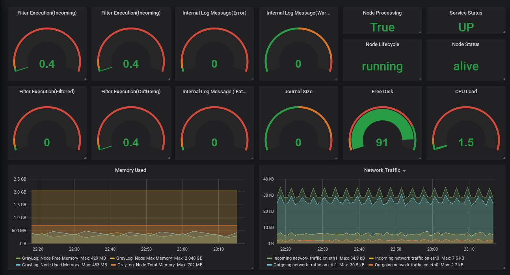
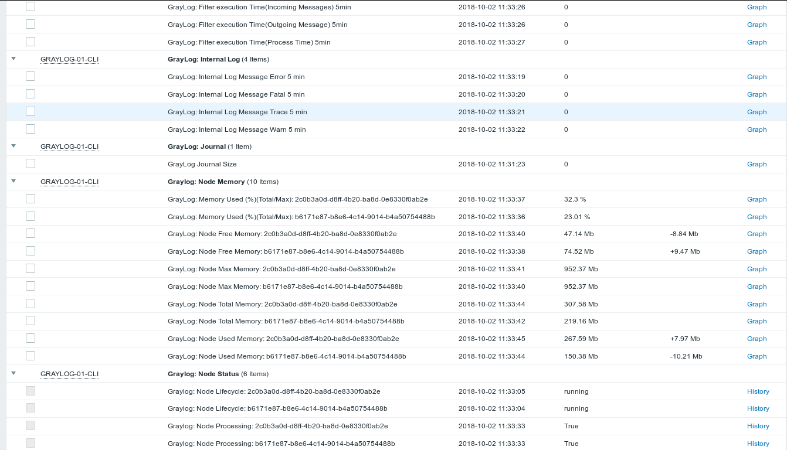

# GrayLog Node Monitoring Using Zabbix

Template created to monitor GrayLog nodes through LLD (Low Level Discovery)

We added a feature of Zabbix called LLD (Low Level Discovery) in the model, this automation seeks to facilitate the discovery of the nodes in GrayLog, so that you do not have to register the nodes manually just set the time of the discovery rule.

## Monitoring Itens:

* GrayLog: Filter execution Time (FIltered, Incomming, Outgoing, Process)
* GrayLog: Internal Log Message (Error, Fatal, Trace, Warn)
* GrayLog: Journal ( Journal Size)
* GrayLog: Node Memory(LLD)/( Free Memory, Max Memory, Total Memory, Used Memory)
* GrayLog: Node Status (Lifecycle, Processing, Status )
* GrayLog: Services


## Requirements

- Zabbix 3.4;
- GrayLog 2.4;
- Zabbix Agent install on Graylog;
- Python 3.4 or  > Python3;
- Imports:
    - import requests
    - import json
    - import sys


## Steps

1. Download the monitoring-graylog.py file and copy it to the scripts folder on your server:

```bash
# cp monitoring-graylog.py  /etc/zabbix/scripts/
# chmod +x monitoring-graylog.py
```
2. Change the variables in the monitoring-graylog.py file:

```bash
cat monitoring-graylog.py
apiUserGray="<Username Graylog>"
apiPassGray="<Password Username>"

## Functions to login in Api Rest ##
def apiGrayLog(valueApi):
    r = requests.get('http://<Ip GrayLog Server>:9000/api/%s' % valueApi, auth=(apiUserGray,apiPassGray))
    return r.text

```

3. Run the script by passing the lldgraylognode parameter:

```bash
# python3.4 monitoring-graylog.py lldgraylognode
{
    "data":[
        {
            "{#NODEID}":"b6171e87-b8e6-4c14-9014-b4a50754488b"
        },
        {
            "{#NODEID}":"2c0b3a0d-d8ff-4b20-ba8d-0e8330f0ab2e"
        }
    ]
}
```

4. Check where the * .conf files in the zabbix agent are stored::

```bash
# grep Include /etc/zabbix/zabbix_agentd.conf
Include=/etc/zabbix/zabbix_agentd.conf.d/*.conf
```
5. Copy the file user_parameter_graylog.conf to the includes directory and change the path of the binary python:

```bash
# cp user_parameter_graylog.conf /etc/zabbix/zabbix_agentd.conf.d/
# cat user_parameter_graylog.conf
UserParameter=graylog.node.men[*],/usr/bin/python3.4 /etc/zabbix/scripts/monitoring-graylog.py monnode $1 $2
UserParameter=graylog.cluster.status[*],/usr/bin/python3.4 /etc/zabbix/scripts/monitoring-graylog.py moncluster $1 $2
UserParameter=graylog.inter.log[*],/usr/bin/python3.4 /etc/zabbix/scripts/monitoring-graylog.py monmetric $1 $2
UserParameter=graylog.journal.size[*],/usr/bin/python3.4 /etc/zabbix/scripts/monitoring-graylog.py monmetric $1 $2
UserParameter=graylog.proc.buffer[*],/usr/bin/python3.4 /etc/zabbix/scripts/monitoring-graylog.py monprocessbuffer $1 $2
UserParameter=graylog.discovery.node,/usr/bin/python3.4 /etc/zabbix/scripts/monitoring-graylog.py lldgraylognode
```
6. Restart zabbix agent

```bash
# systemctl restart zabbix-agent 
```

6.Use zabbix_get to test some items: 

```bash
# zabbix_get -s < IP Agent Zabbix > -k graylog.discovery.node
{
    "data":[
        {
            "{#NODEID}":"2c0b3a0d-d8ff-4b20-ba8d-0e8330f0ab2e"
        }
    ]
}

# zabbix_get -s < IP Agent Zabbix > -k graylog.cluster.status['2c0b3a0d-d8ff-4b20-ba8d-0e8330f0ab2e',lb_status]
alive
```
7. Import the template_graylog-node.xml template into your Zabbix!

# Screenshots

## Grafana:



## Zabbix Latest Data




#### Reference
Fonte: https://www.graylog.org/post/back-to-basics-monitoring-graylog

Blog Onx Solutions: http://blog.onxsolutions.net/monitorando-node-graylog-usando-zabbix/

MarketPlaceGraylog: https://marketplace.graylog.org/addons/1ad55d59-09a0-4dd4-9da6-2eccbbfbed1e

ZabbixShare: https://share.zabbix.com/cat-app/monitoring-system/graylog-node-monitoring-using-zabbix
